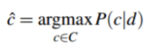

## Benchmark 1

### Readings

- Parts of Chapter 2, Introduction to Information Retrieval
    (Manning, Raghavan, Schütze): [Intro](http://nlp.stanford.edu/IR-book/html/htmledition/the-term-vocabulary-and-postings-lists-1.html), [Tokenization](http://nlp.stanford.edu/IR-book/html/htmledition/determining-the-vocabulary-of-terms-1.html), [Stop
    lists](http://nlp.stanford.edu/IR-book/html/htmledition/dropping-common-terms-stop-words-1.html)
- Sections 4.1, 4.3, and 4.4 of [Search Engines: Information Retrieval in Practice](http://ciir.cs.umass.edu/irbook/) (Croft,
    Metzler and Strohman). Starts on page 72.
- [2.2.3](http://nlp.stanford.edu/IR-book/pdf/02voc.pdf) of Intro to IR: Normalization. If you missed 2.2.1 and 2.2.2 last week, catch up on those also.
- [Term Weighting for
Humanists](https://sense.porganized.com/term-weighting-for-humanists-bf2ed42628c8).
Peter Organisciak.

### Slides

- [Introduction](https://docs.google.com/presentation/d/1cBc9yX2wRSmQoOiG2viUHkZAsKI_dAB2VO3powLBt74/edit?usp=sharing)
-   [Week 2:
    Fundamentals](https://docs.google.com/presentation/d/18R7pWmc49PemCgAJ4020lgibNO1Hp1KdST08kd_a-d4/edit?usp=sharing)
-   [Week 3:
    Features](https://docs.google.com/presentation/d/16jZxqi7zpZrOUA2z14aSpg8BPGJxSO9Qkb6rx4bZLLw/edit?usp=sharing)
- [3.5 -
Features Cont.](https://docs.google.com/presentation/d/1dljGL0QmjY-QJ9O-wpXeVgqk8lO12Klrm6EfgaEQsDg/edit?usp=sharing)

#### Lab Tasks

1. Use [Voyant](https://voyant-tools.org)
to visualize a text or set of texts. It can be anything you want: a
book, a set of lyrics, scripts from a show you like, news articles.
Try out the various features in Voyant: phrases, keywords in
contexts, etc. *No submission*

2. This week's lab task is about getting started with powerful tools that
will underlie many of the skills you learn in the course. The lab task is posted in a [Jupyter
notebook](labs/Lab%202.ipynb)
format on Github.  *Ignore questions 1-3 if you're familiar with Jupyter*

3. This week's lab task is again a series of questions, following along
with a worksheet. Find it
[here](labs/Lab%203.ipynb).

4. - [Lab 4
    Worksheet](labs/Lab%204.ipynb).

### Optional - Text Mining for Art and Criticism

- [Liza Daly's Generative Blackout
    Poetry](http://waxy.org/2016/11/liza-dalys-generative-blackout-poetry/) -
    This work uses some simple language rules that will be useful in
    the future.

The following three readings are web articles related to Twitter bots: for activism, for recontextualization, and a roundup of interesting bots. Not all of these are text related, but serve as a good overview.

-   [How Twitter Bots Turn Tweeters into
    Activists](https://www.technologyreview.com/s/544851/how-twitter-bots-turn-tweeters-into-activists/)
-   [Introducing censusAmericans, A Twitter Bot For
    America](https://fivethirtyeight.com/datalab/introducing-censusamericans-a-twitter-bot-for-america/)
-   [12
    Weird, Excellent Twitter Bots Chosen by Twitter’s Best
    Bot-Makers](http://nymag.com/selectall/2015/11/12-weirdest-funniest-smartest-twitter-bots.html)
-   Optional: [The Rise of Twitter
    Bots](http://www.newyorker.com/tech/elements/the-rise-of-twitter-bots)

- [4.0 - Text Mining for Art and
Criticism](https://docs.google.com/presentation/d/1FZmIQdS5cEuJEG7pudzHCI5iWxrWZb5yus4eT24tW_Y/edit?usp=sharing)

## Benchmark 2

### Topics
 - Natural Language Processing
 - Part of Speech Tagging
 
### Readings

-   [Natural Language Processing for
    programmers](https://worldwritable.com/natural-language-processing-for-programmers-90c4e04dc6de#.dhfapdhxv) part
    2 - Liza Daly
    -   This talks about an old concept, but is written from a
        beginner perspective and is useful for your assignment.
-   [Part of Speech
    Tagging ](https://web.stanford.edu/~jurafsky/slp3/10.pdf)- Chapter
    10 (up to 10.4) of Speech and Language Processing (3rd ed.
    draft)
-   [Chapter 5.7 of the NLTK
    Book](http://www.nltk.org/book/ch05.html) - Bird et. al
    -   Just section 7, but sections 1-2, 4-6 are useful as
        supplements to the SLP reading if you need more info or
        simply find it interesting. Section 7 is the conclusion of
        the chapter, which succinctly describes the ways that we
        understand a part of speech.
- - *Information
    Extraction*. Section 4.6 of [Search Engines: Information
    Retrieval in Practice](http://ciir.cs.umass.edu/irbook/) (Croft,
    Metzler and Strohman). Starts on page 113.
- [Information
    Extraction](https://web.stanford.edu/~jurafsky/slp3/21.pdf)
    (up to and including section 21.2.3). Speech and Language
    Processing (3rd ed. draft).

### Slides

- [05 - Getting Data](https://docs.google.com/presentation/d/1N7qvqvTTxldbTiZ2tqx8OQBUq4dtD3PoUAEdwjD6FGc/edit?usp=sharing)
- [06 - Natural Language Processing 1 - Part of Speech
Tagging](https://docs.google.com/presentation/d/17psGonrrwj0R2DT-Nu34D5kpTP-jBEmthbIQKSeZG2Q/edit?usp=sharing)

### Labs

- [Worksheet for the Lab Task
05](labs/Lab%2005%20-%20Part%20of%20Speech%20Tagging%2C%20Starting%20with%20Pandas.ipynb).

## Benchmark 3 - In-progress

### Topics

- Classification
- Sentiment Analysis

## Week 7: Classification 1

### Readings

 [Naive Bayes Classification and
Sentiment](https://web.stanford.edu/~jurafsky/slp3/6.pdf), Speech
and Language Processing (3rd edition). Dan Jurafsky and James H.
Martin.

**Notation**

We getting to the point of the term where some mathematic notation
is necessary for our readings to communicate the underlying theory.

If you are unfamiliar with Bayesian inference, the description on
the 3rd page of this chapter might not satisfy your curiosity.
The [introduction to Bayes' Theorem from Khan
Academy](https://www.khanacademy.org/partner-content/wi-phi/wiphi-critical-thinking/wiphi-fundamentals/v/bayes-theorem)
can help equip you with some more background about what we use
Bayes' Theorem for.

Since we're looking at classes, you'll start seeing set theory,
like c ∈ C. This means 'c' is an element of 'C', or in the context
our reading, this *class (c) is part of a set of all the possible
classes (C)*.* *Why is that something we'd want to state? Because
for Naive Bayes classification, we'll be choosing the class *c* with
the highest probability given the evidence. The equations simply
need a way to state "consider P(c|d) for all possible classes and
choose the class with the highest value", which they do
with .

### Slides

- [07 -
Classification](https://docs.google.com/presentation/d/1u_VZgEK45u4zbbfxZKo_G-uztNvR0As_gfc5X2c2nU0/edit?usp=sharing)
 - Includes material from: SLP v.3 slides (Jurafsky and Martin )

### For Next Week

- [Lab Task 06
Worksheet](labs/Lab%2006%20-%20More%20Pandas%20and%20Intro%20to%20Classification.ipynb)

### Week 8.1: Classification 2

### Week 8.2 Ethics in Text Mining

### Readings

No required readings this week, focus on the lab task!

**Optional Reading**

-   Brent Daniel Mittelstadt, Patrick Allo, Mariarosaria Taddeo,
    Sandra Wachter, Luciano Floridi. 2016. "[The ethics of
    algorithms: Mapping the
    debate](http://journals.sagepub.com/doi/abs/10.1177/2053951716679679)". *Big
    Data & Society. *Vol 3, Issue 2.
    - Recent BBC2 Story (audio): [Controlling the Unaccountable
Algorithm](http://www.bbc.co.uk/programmes/b085wj18)

As with our class on art and criticism, some of the most accessible work on ethics is from the bot-making community.

-   [Bots Should Punch Up](https://www.crummy.com/2013/11/27/0)
-   [Ethical Bot Making](http://mewo2.com/notes/bot-ethics/)
-   [How to Make a Bot that Isn't
    Racist](https://motherboard.vice.com/en_us/article/how-to-make-a-not-racist-bot)

### Slides

- [Week 08 - Classification
2 and Ethics in Text Mining](https://docs.google.com/presentation/d/1TL4a0SGRcOHXmq4cKXs4dRY6ASDbr-V3vFHh0c_Nj-c/edit#slide=id.g1edffbd9d5_0_177)
 -  Includes material from: SLP v.3 slides (Jurafsky and Martin)

### For Next Week

-   [Lab Task 7
    Worksheet](labs/Lab%2007%20-%20Classification.ipynb)

## Week 9: Clustering

### Readings

-   [Textual
    Analysis](http://www.digitalhumanities.org/companion/view?docId=blackwell/9781405103213/9781405103213.xml&chunk.id=ss1-4-4&toc.depth=1&toc.id=ss1-4-4&brand=default) -
    John Burrows, A Companion to Digital Humanities
-   [Clustering](http://scikit-learn.org/stable/modules/clustering.html) -
    Sci-Kit Learn Documentation: Read *Overview* and the intros to
    2.3.2 (K-Means) and 2.3.6 (Hierarchical clustering)

Supplemental Readings

-   [Cluster
    Analysis](http://www-users.cs.umn.edu/~kumar/dmbook/ch8.pdf) -
    Pang-Ning Tan, Michael Steinbach, Vipin Kumar. *Introduction to
    Data Mining*
-   [Beyond tokens: what character counts say about a
    page](https://sense.porganized.com/beyond-tokens-what-character-counts-say-about-a-page-278d0ccea34c#.nmrtloz6i).
    Peter Organisciak

### Slides

[Week 9 -
Clustering](https://docs.google.com/presentation/d/1UnHbclWT--wxOPwEB5U9uqQ8GPKfliEEpVhQYsDrtJA/edit?usp=sharing)

### For the next two weeks

[Lab 08
Worksheet](labs/Lab%2008%20-%20Clustering.ipynb)

## Spring Break Week

Spring Break. No class.

## Week 10: Topic Modeling and Dimensionality Reduction 1

### Readings

[Topic
modeling made just
simple enough.](https://tedunderwood.com/2012/04/07/topic-modeling-made-just-simple-enough/) 2012.
Ted Underwood.

[Probabilistic Topic
Models](http://dl.acm.org/citation.cfm?id=2133826). 2012.
David Blei.

**Supplemental**

[Introduction to Latent Dirichlet
Allocation](http://blog.echen.me/2011/08/22/introduction-to-latent-dirichlet-allocation/). 2011.
Edwin Chen.

### Slides

[Topic Modeling
Slides](https://docs.google.com/presentation/d/1X5NvF-CvTQk0jwhL74eUSu8u2QblastwkF6jTzzTkeM/edit?usp=sharing)

### For Next Week

[Lab task 09 - Dimensionality Reduction and Sentiment
Analysis](labs/Lab%209%20-%20Dimensionality%20Reduction%20and%20Sentiment%20Analysis.ipynb)

*Recommended*: Get started on your topic modeling assignment. Make
sure you can get MALLET running on your system.

### For Two Weeks from Now

Topic Modeling Assignment Due. See description on the
[Assignments](assignments.md) page.

Post the Problem Statement for your Text Mining Project. See description on the [Assignments](assignments.md) page.

## Week 11.1 Topic Modelling 2

## Week 11.2 Sentiment Analysis

### Readings

[Narrative framing of consumer sentiment in online restaurant
reviews](http://journals.uic.edu/ojs/index.php/fm/article/view/4944).
Dan Jurafsky, Victor Chahuneau, Bryan R. Routledge, Noah A. Smith.

**Optional but Recommended**

[Indexing by Latent Semantic
Analysis](http://lsa.colorado.edu/papers/JASIS.lsi.90.pdf).
Deerwester, Dumais, Furnas, Landauer, Harshman.

*This is one of our core papers in Library and Information Science - 13k citations can't be wrong. You'll notice that these famous papers are particularly easy to read - Chengzheng Zhai's smoothing paper is
another example - a good reminder that being clever is only useful if you can communicate it.*

### Slides

[Topic Modelling II and Sentiment
Analysis](https://docs.google.com/presentation/d/1aRo0-Ho9auR751MDKYIE4HIedmnYzqyELFignJN05Yk/edit?usp=sharing)

### For Next Week

Topic Modeling Assignment Due. See description on
the [Assignments](assignments.md) page.

Post the Problem Statement for your Text Mining Project. See description on the [Assignments](assignments.md) page.

## Week 12: Visualization

### Readings

It's a busy time, no readings this week!

### Slides

[Week 13 -
Visualization](https://docs.google.com/presentation/d/1R72aBkSYzqZlvtOVm9q-8-_Ogmc0QW9XQ7cZ2JKEm4Y/edit?usp=sharing)

### For Next Week

-   Literature Review and Data Collection for your final project.

## Week 13: Word Embeddings

### Readings

- [Word Embeddings for the digital
humanities](http://bookworm.benschmidt.org/posts/2015-10-25-Word-Embeddings.html). 2015.
Benjamin Schmidt.

- [Vector Representations of
Words](https://www.tensorflow.org/tutorials/word2vec) (stop at
'Building the Graph'). Tensorflow Tutorials.

**Supplemental (Optional)**

- [Distributed Representations of Words and Phrases and their Compositionality](https://papers.nips.cc/paper/5021-distributed-representations-of-words-and-phrases-and-their-compositionality.pdf).
Mikolov et. al.

**Bonus**

Something to play with: [the "Bonus App" at the bottom of Radim Řehůřek's Word2Vec
tutorial](https://rare-technologies.com/word2vec-tutorial/).

## Week 14: What's Next: Remainder Notes from Text Mining

### Slides

[Week 15 - What's
Next](https://docs.google.com/presentation/d/1GwGK3b4U_Z3xt_fFZiWB86jRWreGn00p9arfi2oPvYg/edit?usp=sharing)

### Reminders

May 3rd is the last day to turn in late lab tasks! Get them in!
